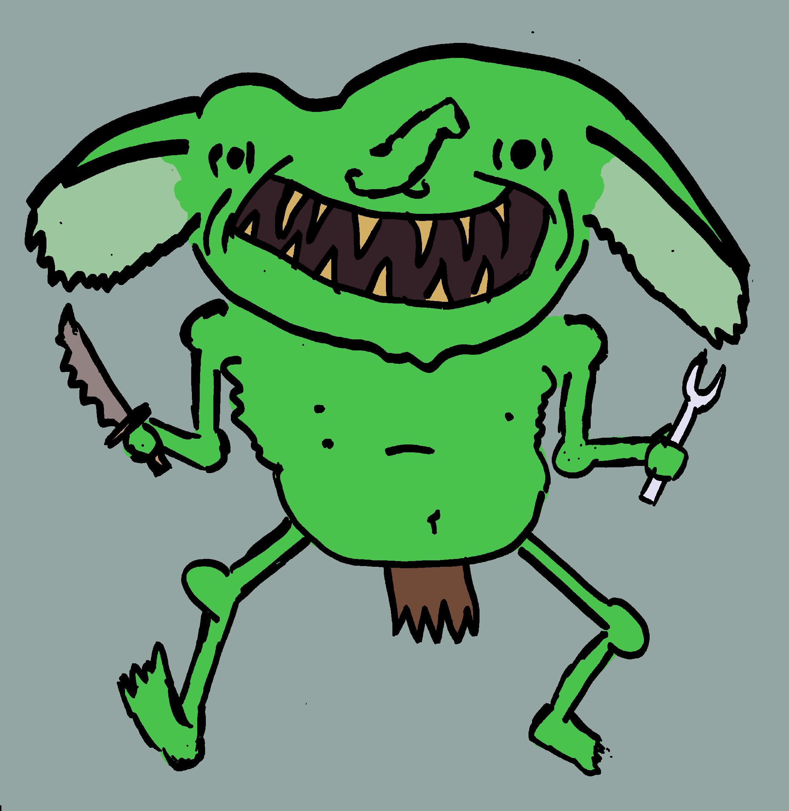

\newcommand*\diceatk{\vcenter{\hbox{\includegraphics[height=2.5ex]{img/atk}}}}
\newcommand*\dicedef{\vcenter{\hbox{\includegraphics[height=2.5ex]{img/def}}}}
\newcommand*\dicespc{\vcenter{\hbox{\includegraphics[height=2.5ex]{img/spec}}}}
\newcommand*\statbody{\vcenter{\hbox{\includegraphics[height=2.5ex]{img/heart}}}}
\newcommand*\statspeed{\vcenter{\hbox{\includegraphics[height=2.5ex]{img/speed}}}}
\newcommand*\statmind{\vcenter{\hbox{\includegraphics[height=2.5ex]{img/brain}}}}

Check out this hot tamale: $\diceatk$$\dicedef$$\dicespc$$\statbody$$\statspeed$$\statmind$

# Dice Anatomy

Check out this hot tamale: $\diceatk\dicedef\dicespc\statbody\statspeed\statmind$

Check out this hot tamale: $\diceatk\dicedef\dicespc\statbody\statspeed\statmind$

Testing tables

| A | B |
|:-:|:-:|
| test | bean |
| test | bean |
| test | bean |
| test | bean |
| test | bean |
| test | bean |
| test | bean |
| test | bean |
| test | bean |
| test | bean |
| test | bean |
| test | bean |
| test | bean |
| test | bean |
| test | bean |
| test | bean |
| test | bean |
| test | bean |
| test | bean |
| test | bean |
| test | bean |
| test | bean |
| test | bean |
| test | bean |
| test | bean |
| test | bean |
| test | bean |
| test | bean |

\chapter{Monsters}

### Speedy boy

Might:
: $\statbody\statbody$

Magic:
: $\statmind\statmind\statmind$

Move:
: $\statspeed\statspeed\statspeed\statspeed$

---

\newpage

# Large Chunk

**Might:** $\statbody\statbody$

Mind:
: $\statmind\statmind\statmind$

Move:
: $\statspeed\statspeed\statspeed\statspeed$

Wants:
: To eat your knees.

Tactics
: Jumps out from behind cover.

---

\newpage

# Tably chunker

| Might | Mind | Magic |
|:-:|:-:|:-:|
| $\vcenter{\hbox{\includegraphics[height=5ex]{img/gobbo_cleaned_bg.png}}}$ | $\statmind$$\statmind$$\statmind$ | Lorem ipsum dolor sit amet, consectetur adipiscing elit. Nulla tellus est, sagittis sed tempor eu, vehicula ut mauris. In suscipit id sem id varius. Etiam porttitor nibh eu egestas euismod. Ut elementum est ligula,  |

| Might | Mind | Magic |
|:-:|:-:|:-:|
| $\statbody$$\statbody$ | $\statmind$$\statmind$$\statmind$ | $\statspeed$$\statspeed$$\statspeed$$\statspeed$ |

Wants:
: To eat your knees.

Tactics
: Jumps out from behind cover.

---

\newpage

# Largeess Chunk

\begin{minipage}{0.3\textwidth}% adapt widths of minipages to your needs
\includegraphics[width=\linewidth]{img/gobbo_cleaned_bg.png}
\end{minipage}
\hfill
\begin{minipage}{0.6\textwidth}% adapt widths of minipages to your needs
Might:
: $\statbody\statbody$

Mind:
: $\statmind\statmind\statmind$

Move:
: $\statspeed\statspeed\statspeed\statspeed$

\end{minipage}

Might:
: $\statbody\statbody$

Mind:
: $\statmind\statmind\statmind$

Move:
: $\statspeed\statspeed\statspeed\statspeed$

Wants:
: To eat your knees.

Tactics
: Jumps out from behind cover.

  
